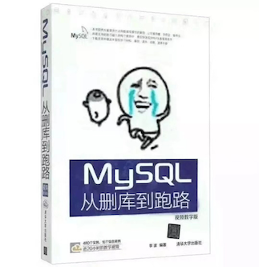
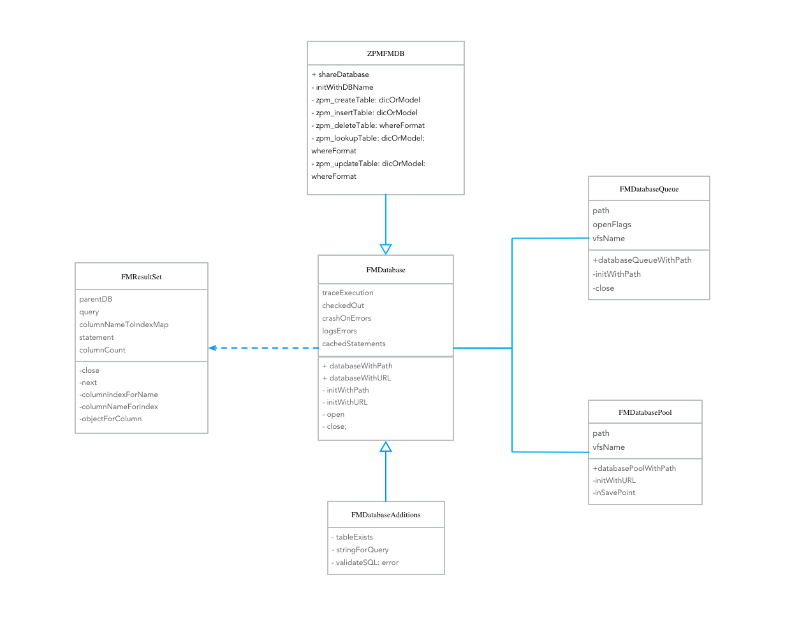

# ZPMFMDB
封装好的FMDB，目标是不会SQL也能直接使用。




## 安装方法
```
pod 'ZPMFMDB'
```


## 安装要求

| ZPMFMDB 版本 | FMDB 版本 |  最低 iOS Target | 注意 |
|:----------------:|:----------------:|:----------------:|:-----|
| 1.x | 2.X | iOS 8 | 要求 Xcode 7 以上  |

ZPMFMDB 依赖于 fmdb，可以在 [fmdb README.markdown](https://github.com/ccgus/fmdb/blob/master/README.markdown) 中找到更多关于依赖版本有关的信息。


## 功能描述

* 针对于FMDB的二次封装
* 支持swift和oc
* 线程安全，支持事务操作
* 操作简单, 支持Model和Dictionary直接存储，不侵入你的任何Model
* 拓展性强
* 不需要实现任何协议


## 使用教程

### 一、创建数据库
#### 单例方法

如果工程只需要一个数据库，推荐使用单例方式

    + (instancetype)shareDatabase;
    + (instancetype)shareDatabase:(NSString *)dbName;
    + (instancetype)shareDatabase:(NSString *)dbName path:(NSString *)dbPath;
    
#### init方法

如果工程需要多个不同的数据库，推荐使用init方法

    - (instancetype)initWithDBName:(NSString *)dbName;
    - (instancetype)initWithDBName:(NSString *)dbName path:(NSString *)dbPath;
    

### 二、创建一个数据库和表
```
  // TABLE_NAME:你的表名  [Person class]：你自定义的model类
  [db zpm_createTable:TABLE_NAME dicOrModel:[Person class]];
```


### 三、增删改查
#### 增加

##### 插入一条数据
```
  // person:你的实例化的model类
  [_db zpm_insertTable:TABLE_NAME dicOrModel:person];
  // 或者一个字典
  [_db zpm_insertTable:TABLE_NAME dicOrModel:@{@"name": @"小李"}];
```

##### 插入一组数据
```
  // 向TABLE_NAME表中插入一组数据，其中array是一个字典或者model的集合
  [db zpm_insertTable:TABLE_NAME dicOrModelArray:array];
```

#### 删除

##### 删除一条数据
```
  // 删除最后一条数据
  [_db zpm_deleteTable:TABLE_NAME whereFormat:@"WHERE pkid = (SELECT min(zpid) FROM TABLE_NAME)"];
```

##### 删除表中全部数据
```
  //删除全部数据
  [db zpm_deleteAllDataFromTable:TABLE_NAME];
```

#### 更新
##### 指定某条数据的更改
```
  // 更新表中最大的id的名字为小明
  [_db zpm_updateTable:TABLE_NAME dicOrModel:@{@"name":@"小明"} whereFormat:@"WHERE zpid = (SELECT max(zpid) FROM TABLE_NAME)"];
  // 或者是model
  person.name = @"小明";
  [_db zpm_updateTable:TABLE_NAME dicOrModel:person whereFormat:@"WHERE zpid = (SELECT max(zpid) FROM TABLE_NAME)"];
```

#### 查找

##### 查找表中所有数据
```
  NSArray *personArr = [_db zpm_lookupTable:TABLE_NAME dicOrModel:[Person class]];
```

##### 按条件查找
```
  // 查找表中id是2的数据
  NSArray *personArr = [_db zpm_lookupTable:TABLE_NAME dicOrModel:[Person class] whereFormat:@"where zpid = '2'"];
```

### 四、多线程操作之线程安全

以上操作是非线程安全的，要想保证线程安全，还是采用FMDB的方法，使用FMDatabaseQueue中的inDatabase方法，保证所有操作都放在下面block中执行，而block块内代码会被提交到一个队列中，从而保证线程安全，但要注意的是block不能嵌套使用

```
    // 将操作语句放入block中即可保证线程安全, 如:
    [db zpm_inDatabase:^{
        [db zpm_insertTable:TABLE_NAME dicOrModel:person];
    }];
```

或者将一系列操作放到block中亦可，如
```
    [db zpm_inDatabase:^{
        [db zpm_insertTable:TABLE_NAME dicOrModel:@{@"name":@"xiaoming"}];
        [db zpm_lookupTable:TABLE_NAME dicOrModel:[Person class] whereFormat:@"where name = 'xiaoming'"];
    }];
```

简单来说就是一句代码：
```
- (void)zpm_inDatabase:(void (^)(void))block;
```

### 五、事务操作

场景：用A给B转账100元的问题来简单阐述下事务，首先查询下A的余额，如果>=100元，那么A账户先减去100元,，接着查询B账户的余额，B账户加上100元，如果说在这之间有任何一个环节出了问题(余额不够, A查询或减去100元操作失败，B查询或加上100元操作失败)，则进行回滚操作，相当于回到操作之前的状态，简单说，这就是一个事务操作
```
/**
    Person *p = [[Person alloc] init];
    p.name = @"小李";
    for (int i = 0; i < 1000; i++) {
        [db zpm_inTransaction:^(BOOL *rollback) {
            BOOL flag = [db zpm_insertTable:TABLE_NAME dicOrModel:p];
            if (!flag) {
                *rollback = YES; //只要有一次不成功,则进行回滚操作
                return;
            }
        }];
    }
 */
```
操作事务的方法，一句代码：
```
- (void)zpm_inTransaction:(void(^)(BOOL *rollback))block;
```

## 架构图



### 作者
* zhao.liu

## Thanks

